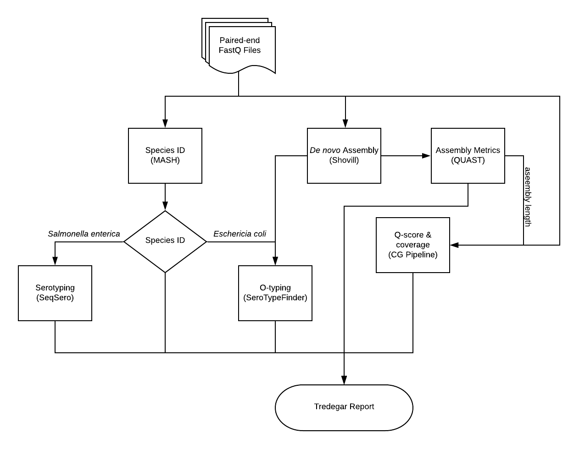
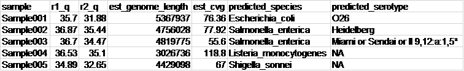

# Tredegar v2.0
A bioinformatics pipeline for QC of WGS data generated from infectious disease isolates. 


## Data workflow:


### Taxonomic Prediction:
Tredegar uses [MASH](http://genomebiology.biomedcentral.com/articles/10.1186/s13059-016-0997-x), a fast genome distance estimation algorithm, to determine the taxonomic identitity of all isolates; MASH is capable of accurate identification up to the species level. 
For *Salmonella enterica* and *Escherichia coli* isolates, subspecies characterization (serotype) is determined through [SeqSero](http://jcm.asm.org/content/early/2015/03/05/JCM.00323-15) and [SerotypeFinder](http://jcm.asm.org/content/53/8/2410.full.pdf+html), respectively. 

### Read Quality
De novo assemblies are performed using Shovill and assembly metrics are collected using Quast. Quast calculations for assembly length are used to gauge genome coverage using 
the CDC's CG Pipeline--Q-score averages for the forward and reverse reads are also gauged using the CG Pipeline.


### Sample Output


- r1_q and r2_q: Average Q-score for the forward and reverse reads, respectively
- est_genome_length: Shovill assembly length calculated by Quast
- est_cvg: Calculated genome coverage calculated by CG Pipeline
- predicted_species: Genus and species prediction by Mash
- predicted_serotype: Serotype predictions by SeqSero and SerotypeFinder for *Salmonella enterica* and *Escherichia coli* isolates, respectively

---

### Usage: 

````
$ tredegar.py -i <input_dir> -o <output_dir>
````

`<input_dir>` can be either the path to an input directory containing paired-end fastq read data or path to a mounted BaseSpace project.

````
